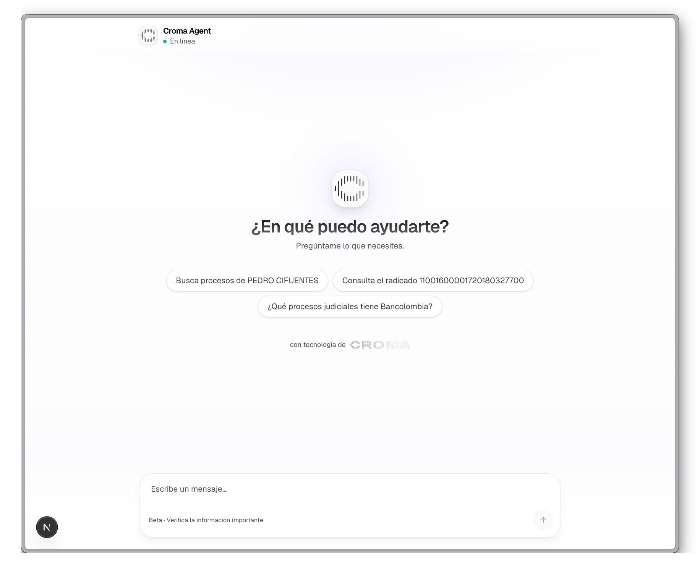

# Croma Agent: asistente legal con consultas a la Rama Judicial

Chat de IA en español que responde preguntas generales y, además, consulta
procesos judiciales reales de la Rama Judicial de Colombia a través de la API de
[Croma](https://usecroma.com): búsqueda por nombre (persona o empresa) y por
número de radicado.

Construido con Next.js (App Router) y el [Vercel AI SDK](https://ai-sdk.dev), con
streaming de la respuesta y de cada llamada a herramienta, renderizado de
Markdown y branding de Croma.



---

## Características

- Chat en español con un asistente general (`Croma Agent`).
- Tool calling con streaming: el modelo decide cuándo buscar, ejecutamos la
  herramienta y mostramos un pill de estado en vivo (cargando, éxito, o error).
- Dos herramientas conectadas a datos reales de la Rama Judicial:
  - `searchByName`: procesos por nombre de persona o empresa.
  - `searchByNumber`: proceso por número de radicado.
- Respuestas en Markdown (tablas, negritas) renderizadas con `streamdown`.
- UI con branding Croma: header glass, hero con sugerencias, burbujas de
  usuario y asistente, autoscroll robusto.
- Modelo `openai/gpt-oss-120b` servido por Groq (rápido), con el razonamiento
  oculto.

## Stack

| Capa        | Tecnología                                                        |
| ----------- | ----------------------------------------------------------------- |
| Framework   | Next.js 16 (App Router, Turbopack), React 19, TypeScript          |
| Estilos     | Tailwind CSS v4 (`@import "tailwindcss"`), fuentes Geist          |
| IA          | Vercel AI SDK v6 (`ai`, `@ai-sdk/groq`, `@ai-sdk/react`), Zod     |
| Modelo      | `openai/gpt-oss-120b` vía Groq                                    |
| Datos       | API de Croma, Rama Judicial Colombia                             |
| Gestor pkgs | bun                                                               |

## Puesta en marcha

Requisitos: bun (o npm) y dos claves (Groq y Croma).

```bash
# 1. Instalar dependencias
bun install

# 2. Configurar variables de entorno
cp .env.example .env.local
#   y rellena:
#   GROQ_API_KEY=...   -> https://console.groq.com/keys
#   CROMA_API_KEY=...  -> https://usecroma.com  (docs: https://docs.usecroma.com)

# 3. Levantar el dev server
bun run dev
```

Abre [http://localhost:3000](http://localhost:3000) y prueba una sugerencia como
"Busca procesos de PEDRO CIFUENTES" o pega un número de radicado.

> Sin `GROQ_API_KEY` el chat no responde. Sin `CROMA_API_KEY` las herramientas
> devuelven un error honesto de "sin acceso", no datos falsos.

## Estructura

```
app/
  page.tsx              UI del chat (hero, sugerencias, pills de tool-call, autoscroll)
  layout.tsx            Layout raíz y fuentes Geist
  globals.css           Tailwind v4 y @source para streamdown (no borrar)
  tools.ts              Las 2 herramientas, conectadas a la API de Croma
  api/chat/route.ts     Route handler: Groq, system prompt y streaming de tools
public/
  croma.svg             Wordmark
  croma-mark.svg        Icono
docs/
  screenshot.png        Captura usada en este README
.claude/skills/
  croma-legal-agent/    El skill que generó este proyecto (ver más abajo)
.env.example            Plantilla de variables (sin secretos)
```

## Las herramientas (`app/tools.ts`)

Ambas usan el helper `cromaPost`, que envía `Authorization: Bearer $CROMA_API_KEY`
contra `https://api.croma.run` y devuelve el JSON, o `{ error }` ante cualquier
fallo.

| Herramienta      | Endpoint                                       | Entrada                                                       |
| ---------------- | ---------------------------------------------- | ------------------------------------------------------------ |
| `searchByName`   | `POST /co/rama-judicial/cases-by-entity/v1`    | `name`, `entity_type` (`natural`/`juridical`), `active_only`, `page` |
| `searchByNumber` | `POST /co/rama-judicial/cases-by-radicado/v1`  | `registration_number` (20 a 25 dígitos)                      |

Documentación de la API: <https://docs.usecroma.com/guides/colombia/rama-judicial>.

## No fabricamos datos

Es la regla central del proyecto. Una herramienta solo puede devolver datos
reales del endpoint o un error honesto, nunca algo intermedio:

- Si falta `CROMA_API_KEY` o la API responde con error, devuelve `{ error: "..." }`.
- El system prompt instruye al modelo a reportar el error y no inventar ni
  rellenar resultados.
- La UI muestra el error como un pill de aviso, no como un éxito falso.

Resultados fabricados confundirían a usuarios reales en un contexto legal. No
sustituyas los errores por datos de ejemplo.

## El skill incluido

Este proyecto fue generado con el skill de Claude Code `croma-legal-agent`,
incluido en [`.claude/skills/croma-legal-agent/`](.claude/skills/croma-legal-agent/)
para que quede versionado junto al ejemplo.

- `SKILL.md`: instrucciones del scaffold.
- `assets/`: plantillas que se copian al proyecto. Nota: el `assets/app/tools.ts`
  del skill es la versión sin conectar (devuelve "sin acceso" honesto). En este
  proyecto, `app/tools.ts` ya está conectado a la API real de Croma.

Para regenerar o replicar el scaffold en otro proyecto Next.js, invoca el skill
desde Claude Code (`/croma-legal-agent`) y luego conecta los endpoints siguiendo
`app/tools.ts`.

## Seguridad y secretos

- Las claves no se suben. `.env.local` está en `.gitignore` (`.env*`); solo se
  versiona `.env.example` con valores vacíos.
- No hay claves hardcodeadas en el código: todo sale de `process.env`.
- Antes de publicar se verificó que el árbol a subir no contiene tokens
  (`GROQ_API_KEY`, `CROMA_API_KEY`, `Bearer ...`).

## Licencia

Demo con fines educativos.
